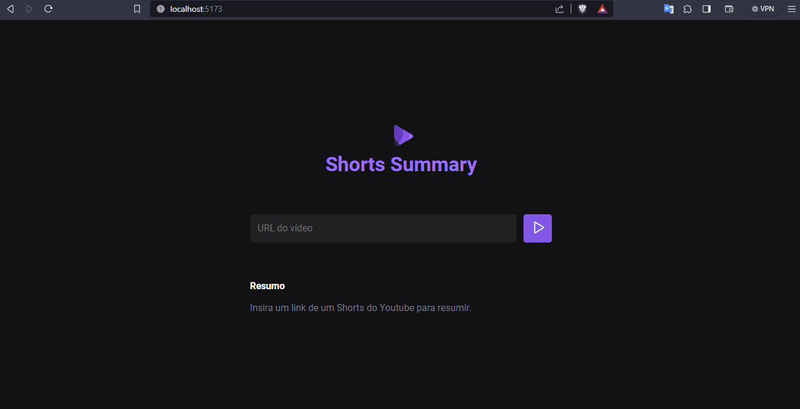

<h1 align="center"> #NLW13-AI - Shorts Summary</h1>

  Projeto foi desenvolvido em evento gratuíto da <a href="https://rocketseat.com.br">Rocketseat</a> 💜 onde criamos uma aplicação para gerar a descrição de Shorts do Youtube.

  <a href="#tecnologias">Tecnologias</a>&nbsp;&nbsp;&nbsp;|&nbsp;&nbsp;&nbsp;
  <a href="#projeto">Projeto</a>&nbsp;&nbsp;&nbsp;|&nbsp;&nbsp;&nbsp;
  <a href="#licenca">Licença</a>&nbsp;&nbsp;&nbsp;|&nbsp;&nbsp;&nbsp;
  <a href="#demonstracao">Demonstração</a>

  

## 🚀 Tecnologias
Esse projeto foi desenvolvido com as seguintes tecnologias:

### Front-end

- ViteJS
- JavaScript
- FFmpeg
- Axios

 

  
  
  

  

### Back-end
- NodeJS
- Express
- Hugging Face

 

  
  
  
  
  

## 💻 Projeto

O Shorts Summary é uma aplicação em JavaScript que utilizando a bibliteca de AI da Hugging Face gera a transcrição de vídeos e os resume.

### Melhorias

Apliquei um fluxo de tratativa de erros que não gerasse o crash do servidor no backend.

## Licença

Esse projeto está sob a licença MIT.

## Demonstração
 

  

---
